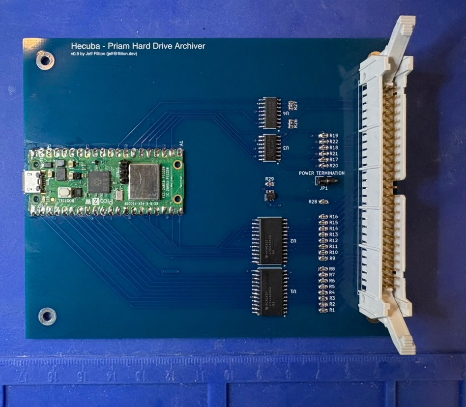

# Hecuba

A read-only imager for Priam DISKOS 8-inch Winchester drives, talking to the
drive over its native PRIAM 50-pin interface. Three parts: a small interface
board, firmware for the Raspberry Pi Pico 2 W that plugs into it, and host-side
Python tools that image the drive, recover damaged sectors offline, and walk
the recovered filesystem.

It was built to recover a Priam 3450 pulled from an Intel Multibus development
system (iSBC 215 controller, iRMX-86), and has imaged that drive in full. The
name: Hecuba was queen of Troy and wife of Priam.

## For data preservationists

If you have a Priam DISKOS 8-inch drive (a 3450, or likely a 7050) whose
contents you want to archive, email <jeff@flitton.dev>. I have a handful of
assembled Hecuba boards and can send you one. I am also glad to help with the
imaging and recovery, and to answer questions about the drive or its interface.

## Layout

| Directory | Contents | README |
|---|---|---|
| `hardware/` | KiCad project for the interface board: schematic, layout, BOM, measured termination values, 50-pin pinout | [hardware/README.md](hardware/README.md) |
| `firmware/` | Pico 2 W firmware: PRIAM register bus, PIO/DMA track capture, USB serial console | [firmware/README.md](firmware/README.md) |
| `software/` | Host tools: whole-drive imaging, three offline recovery passes, iSBC 215 sector decoder, iRMX-86 filesystem walker, defect map | [software/README.md](software/README.md) |

## Why it exists

These drives have a unique interface that resembles SASI at first glance but
is distinctly different.

- The heads move only on the drive's own command. There is no STEP line; a seek
  is a register write over the ribbon. The drive must be powered, spun up, and
  answering before it will read anything.
- The interface is recovered NRZ data plus clock on RS-422 pairs at 6.4 Mbit/s,
  not raw flux. A flux imager has nothing to read.

Acquisition and decoding are kept separate: capture each track once, cleanly,
then decode and repair offline, minimizing drive wear.

## Workflow

1. Build the board (`hardware/`). Rev 0.9A is fabricated and assembled.
2. Build and flash the firmware (`firmware/`), then bring the drive up from the
   USB serial console: `up`, `id`, `pins`, `stair`.
3. Image the drive with `software/sweep.py`, which drives that console and
   writes per-track sector images plus every raw capture.
4. Recover remaining sectors offline with `vote_repair.py`, `rescue.py`, and
   `deep_rescue.py`.
5. Walk the volume with `irmx_fs.py`, and attribute unrecovered sectors with
   `defect_map.py`.

## Read-only

The board has no copper on the write lines, and the firmware has no code path
that asserts WRITE GATE. Writing to a disk would require modifying the board.

## Scope

The sector decoder and filesystem walker target what this drive held: the Intel
iSBC 215 512-byte sector format and iRMX-86 named volumes. The board and
firmware are format-agnostic and capture raw bits from any drive with the PRIAM
interface. Termination values in `hardware/` were measured on one drive;
measure yours before populating.

Only the DISKOS 3450 has been tested. The DISKOS 7050 shares the same
interface, electrical spec, and service manual, so the board and firmware
should work on it as well, unconfirmed. The 7050 has 1049 cylinders to the
3450's 525, and that count is hardcoded in `firmware/include/priam_proto.h`
and `software/sweep.py`; the `id` command also expects the 3450's ID code.

No disk contents are part of this repository.

## License

The firmware and software are released under the MIT License, see
[LICENSE](LICENSE). The hardware design under `hardware/` is released under the
CERN Open Hardware Licence Version 2, Permissive (CERN-OHL-P-2.0), see
[hardware/LICENSE](hardware/LICENSE).

Both licenses allow commercial use, and both require that the copyright notice
and license text stay with copies and derived works. Both disclaim all
warranties: the software, the firmware, the design files, and any board built
from them are provided as is, and the risk of building and using them is
yours. Vendor symbol and footprint files under `hardware/lib/` are Texas
Instruments' and are not covered by either license.

## Reference documents

- [Priam 8-inch Winchester maintenance manual, July 1982](https://bitsavers.org/pdf/priam/Priam8_Maint_Jul82.pdf),
  and its [drawings volume](https://bitsavers.org/pdf/priam/Priam8_Maint_Drawings_Jul82.pdf)
  (schematics; an [800 dpi scan](https://bitsavers.org/pdf/priam/Priam8_Maint_Drawings_800dpi_Jul82.pdf) is also there)
- [Intel iSBC 215 Winchester Disk Controller Hardware Reference Manual,
  121593-002, September 1981](https://bitsavers.org/pdf/intel/iSBC/121593-002_iSBC_215_Winchester_Disk_Controller_Hardware_Reference_Manual_Sep1981.pdf)
- David Gesswein's excellent [mfm](https://www.pdp8online.com/mfm/) project, which documents the iSBC 215 sector format

## Author

Jeff Flitton, <jeff@flitton.dev>
